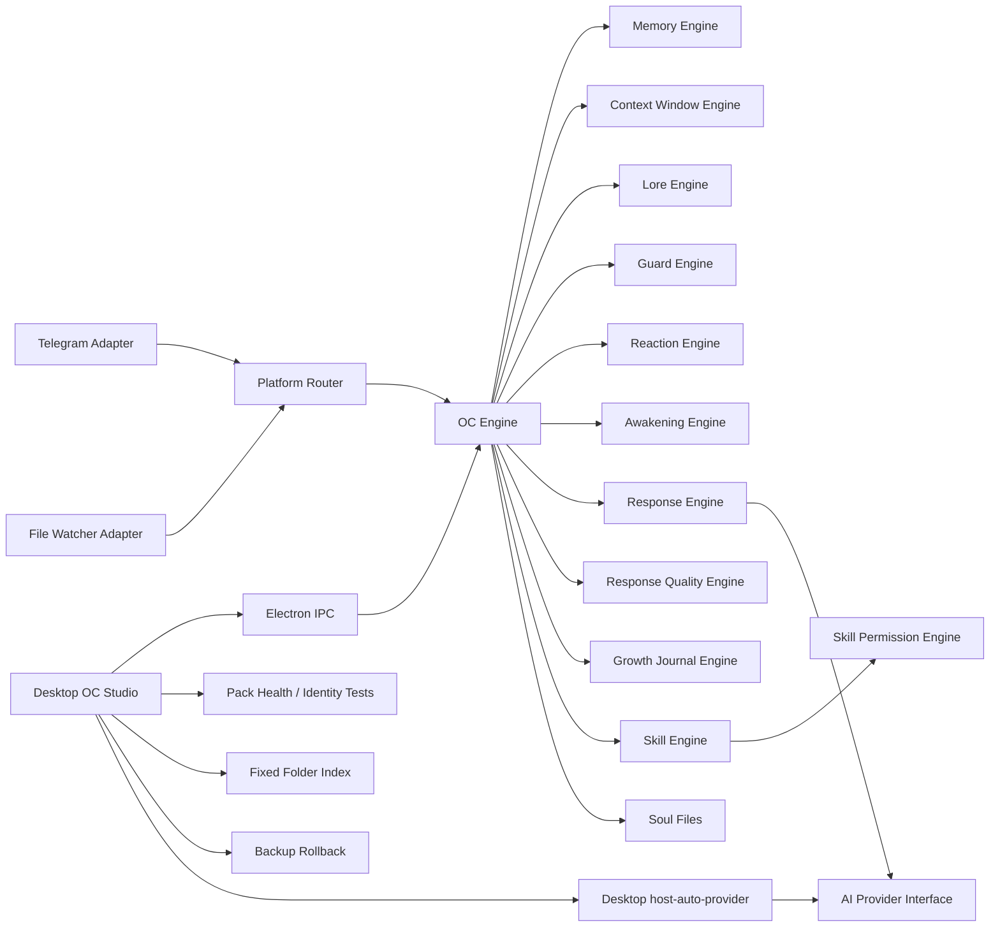

# Architecture

MuseEgg Core separates OC life logic from platform channels.

## Core Flow

1. A platform adapter creates an OC event.
2. `OCEngine` emits it through `EventBus`.
3. `MemoryEngine` records memorable events.
4. `ContextWindowEngine` prepares a short-term context snapshot for follow-up understanding.
5. `AwakeningEngine` scores the event and writes wake logs when needed.
6. `GuardEngine` checks enabled OC boundaries.
7. `ReactionEngine` finds a matching rule.
8. `SkillEngine` finds relevant OC skills and `SkillPermissionEngine` filters unsafe or unsupported permissions.
9. `ResponseEngine` returns a rule-based MVP response or passes relevant memories, lore, skills, and context to an AI provider.
10. `ResponseQualityEngine` scores the output for identity drift, private data risk, incomplete output, and formatting issues.
11. `GrowthJournalEngine` writes a daily growth journal entry when enabled.
12. `ContextWindowEngine` records the event and OC response for the next turn.
13. `PlatformRouter` maps the result back to the channel.

## AI-Ready Boundary

`AIProvider` is defined in `@muse-egg/oc-schema`. The core package only depends on that interface. The desktop app injects `host-auto-provider`, which can route OpenAI OAuth, Gemini, Ollama, and OpenAI-compatible requests from host settings. Developers can still self-connect a provider through `new OCEngine(pack, { aiProvider })`.

## Maintainer Publishing Boundary

GitHub publishing belongs to project maintainers, not ordinary MuseEgg users or OC Packs. MuseEgg runtime does not ask users to push GitHub updates. App update checks may read public release metadata, but OC identity, private packs, tokens, and local memory are not part of publishing.
