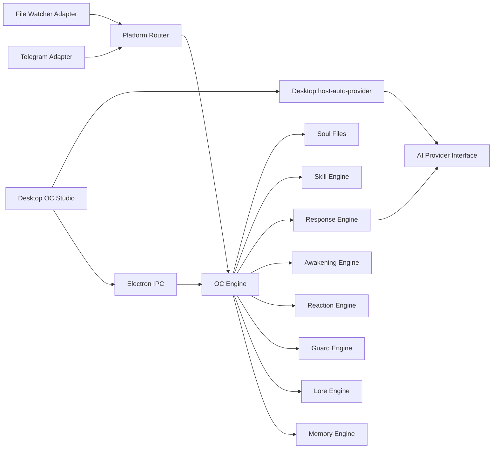

# Architecture

MuseEgg Core separates OC life logic from platform channels.

## Core Flow

1. A platform adapter creates an OC event.
2. `OCEngine` emits it through `EventBus`.
3. `MemoryEngine` records memorable events.
4. `AwakeningEngine` scores the event and writes wake logs when needed.
5. `GuardEngine` checks enabled OC boundaries.
6. `ReactionEngine` finds a matching rule.
7. `SkillEngine` finds relevant OC skills.
8. `ResponseEngine` returns a rule-based MVP response or passes relevant skills to an AI provider.
9. `PlatformRouter` maps the result back to the channel.

## AI-Ready Boundary

`AIProvider` is defined in `@muse-egg/oc-schema`. The core package only depends on that interface. The desktop app injects `host-auto-provider`, which can route OpenAI OAuth, Gemini, Ollama, and OpenAI-compatible requests from host settings. Developers can still self-connect a provider through `new OCEngine(pack, { aiProvider })`.
