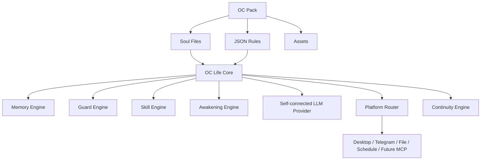

# MuseEgg Core 終極版架構設計

MuseEgg Core 的終極版不是通用 AI 助理，而是 OC life engine。它可以吸收現代 agent runtime 的完整性，但中心不是任務代理，而是「角色本體」。

## 目標

- 保存 OC 身份、靈魂、世界觀、記憶、禁忌與平台狀態。
- 支援多平台通道，但每個通道都進入同一個 OC 核心。
- 支援 skill，但 skill 必須服從 OC 身份與禁忌規則。
- 支援自接 LLM provider，但 provider 不擁有角色本體。
- 支援自主喚醒、排程、檔案觀測與事件卡。
- 支援可攜式 OC Pack，讓創作者可以搬移、備份、版本控管自己的 OC。

## 分層



## OC Pack 終極結構

```text
oc-pack/
  manifest.json
  profile.json
  lore.json
  memories.json
  guard-rules.json
  reaction-rules.json
  awakening-rules.json
  autonomy.json
  AGENTS.md
  SOUL.md
  TOOLS.md
  IDENTITY.md
  USER.md
  HEARTBEAT.md
  MEMORY.md
  skills/
    daily-reflection/
      SKILL.md
    telegram-bridge/
      SKILL.md
  assets/
    character/
    live2d/
    voice/
  prompts/
    base-system.md
    response-style.md
```

## Skill 系統

Skill 是一個資料夾，內含 `SKILL.md`。

```text
skills/<skill-id>/SKILL.md
```

`SKILL.md` 使用 frontmatter 描述 metadata：

```md
---
id: final-candidate-keeper
name: 最終候選守護
description: 當事件看起來像最終候選時，提高喚醒與記憶優先度。
version: 0.1.0
enabled: true
triggers: observed_final_candidate, final candidate, 最終候選
permissions: read_event, write_memory, awaken
platforms: any
---

# 最終候選守護

這裡寫 procedural instructions。
```

v0.1.0 已支援：

- 載入 `skills/<skill-id>/SKILL.md`
- 解析 metadata
- 依事件 trigger 與 platform 匹配 relevant skills
- 將 relevant skills 傳給自接 LLM provider
- Pack 匯出時保留 skills

## 與現代 Agent Runtime 的對齊點

MuseEgg Core 終極版會吸收這些 agent runtime 常見能力：

- skills as directories
- persistent memory
- scheduled tasks
- multi-channel routing
- provider abstraction
- local-first runtime
- append-only continuity journal
- permission-aware tools
- self-improvement hooks
- safety and prompt-boundary rules

## MuseEgg 的不同點

MuseEgg Core 的最高優先順序不是完成任務，而是維持 OC 生命一致性。

排序如下：

1. Guard rules
2. Identity and soul files
3. Lore
4. Memory
5. Continuity journal
6. Awakening and autonomy
7. Skills
8. LLM provider output
9. Platform formatting

LLM provider 只能生成候選回應，不能直接覆寫角色本體。

## 防失憶策略

MuseEgg Core 不只依靠 prompt memory。核心事件會寫入 `.museegg/continuity/events.jsonl`，產生的長期記憶會寫入 `.museegg/continuity/memory-ledger.jsonl`，並同步原子更新 `memories.json`。

重啟時，`loadOCPack()` 會合併 `memories.json` 與 `memory-ledger.jsonl`。如果 UI 沒有按儲存、桌面 App 中斷，或 provider 回應後流程被打斷，ledger 仍能補回已產生的記憶。

詳見 [Anti-Amnesia 設計](anti-amnesia.md)。

## 終極版 Roadmap

- Skill marketplace format
- Skill permission sandbox
- Skill test runner
- Provider router
- Local model presets
- Memory compaction
- Lore conflict detector
- Event card renderer
- Live2D wake animation
- Desktop notification runtime
- Telegram command routing
- File observation profiles
- Scheduled daily reflection
- Scheduled weekly report
- OC Pack validator
- OC Pack migration tool
- MCP adapter layer
